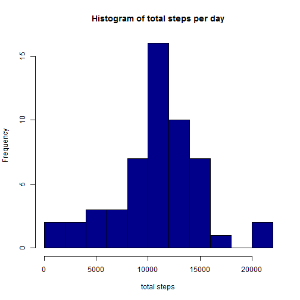
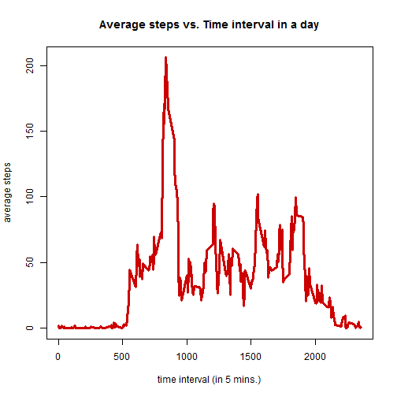
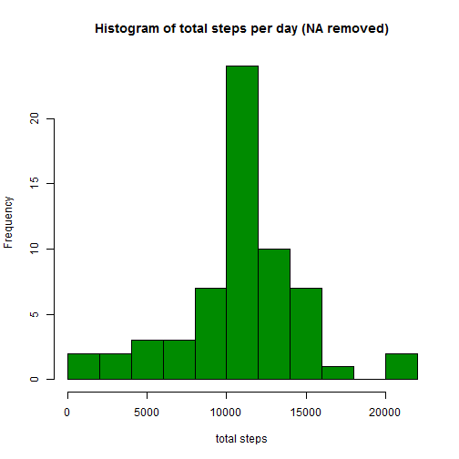
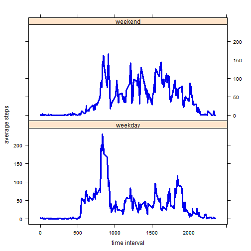

This R Markdown file is for the 1st project for Coursera course "reproduce research".  
It analyzed the daily steps information recorded activity monitoring devices.

###1. Read and clean data


```r
unzip("activity.zip")
nd<-read.csv("activity.csv")
nd$newinterval <- as.factor(nd$interval)
```

###2. Mean of total number of steps taken per day   
The code below calculate the total number of steps taken per day and output a histogram and also calculate the mean & median of the total steps per day.  

```r
library(pander)
```

```
## Warning: package 'pander' was built under R version 3.2.2
```

```r
panderOptions('round', 2)
panderOptions('keep.trailing.zeros', TRUE)
tstep <- tapply(nd$steps, nd$date,sum)
hist(tstep, col="blue4",breaks=10, main="Histogram of total steps per day", xlab="total steps")
```

 

```r
meansteps<-mean(tstep,na.rm=TRUE)
mediansteps<-median(tstep,na.rm=TRUE)
```

####The mean of total number of steps per day is 1.0766189 &times; 10<sup>4</sup>.  
####The median of total number of steps per day is 10765.

###3. Daily activity pattern  
The code below draw a time serial plot of the 5-mins interval (x) and the average steps (y) across all days.  


```r
avestep<-tapply(nd$steps, nd$newinterval,mean,na.rm=TRUE)
ninterval<-unique(nd$interval)
plot(x=ninterval,y=avestep,type="l",col="red3",lwd=3,main="Average steps vs. Time interval in a day",xlab="time interval (in 5 mins.)",ylab="average steps")
```

 

```r
index<-which.max(avestep)
thasmaxsteps<-ninterval[index]
```
####The *835* time interval contains the maximum number of steps. 


###4. Imput missing values   
The total missing value in the original data set is 2304.  

The code below fills the "NA" values of the original dataset with the average steps for that 5-minute interval. The new data set is named as *cdata*.


```r
total_NA_number <- sum(is.na(nd$steps))
cdata <- nd
info <- data.frame(ninterval,avestep)
for (i in 1:dim(cdata)[1]) { 
  if(is.na(nd$steps[i])) {
  cort<-nd$interval[i]
  cdata$steps[i]<-info$avestep[which(info$ninterval==cort)]}
  else{}
  }
```

The histogram with NA filled by average steps is

```r
ctstep <- tapply(cdata$steps, cdata$date,sum)
hist(ctstep, col="green4",breaks=10, main="Histogram of total steps per day (NA removed)", xlab="total steps")
```

 

Compare with histogram of data set with NA values, the frequence of steps # near the average is increased. This is reasonalbe since we filled the NA with mean values, so the distribution of steps are more concentrated near the mean.   

####The new mean of total number of steps per day is 1.0766189 &times; 10<sup>4</sup>.  
####The new median of total number of steps per day is 1.0766189 &times; 10<sup>4</sup>.  

Compare with mean & median of data set with NA values, the new results do not change too much. This is also reasonalbe as we filled the NA with mean values. 

###5. Compare activity pattern between weekdays and weekend      

The code below draw the time serial plot of average stpes ~ time interval in weekend and weekdays.   

```r
timeinfo <- as.POSIXct(cdata$date, format = "%Y-%m-%d")
weekinfo <- weekdays(timeinfo)
weekdayname <- c('Monday','Tuesday','Wednesday','Thursday','Friday')
fweek <- c('weekend','weekday')[(weekinfo %in% weekdayname)+1L ]
cdata$fweek <- fweek 

daydata <- cdata[which(cdata$fweek=='weekday'),]
enddata <- cdata[which(cdata$fweek=='weekend'),]

daves<-tapply(daydata$steps, daydata$newinterval,mean,na.rm=TRUE)
eaves<-tapply(enddata$steps, enddata$newinterval,mean,na.rm=TRUE)
faves<-c(daves,eaves)
ftint <- c(ninterval,ninterval)
fweek <- c(rep('weekday', times=288),rep('weekend',times=288))
fweek <- as.factor(fweek)
fdata <- data.frame(faves, ftint, fweek)

library(lattice)
xyplot(faves~ftint | fweek, data=fdata,layout=c(1,2),type='l',xlab='time interval',ylab='average steps',lwd=3,col='blue2')
```

 

####According to the images, there are peaks at morning in weekdays but no peak at weekends, which indicates people get up earlier during weekdays. 
